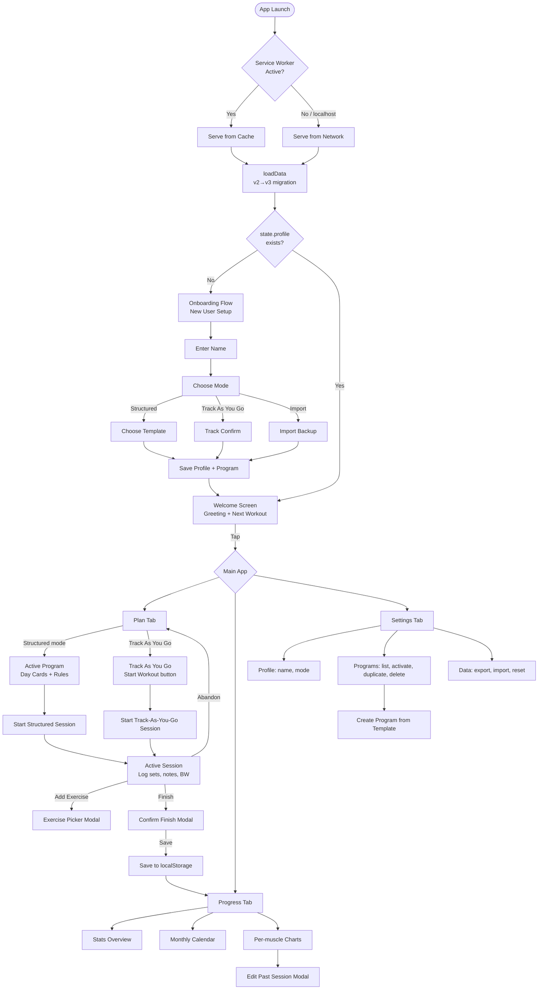
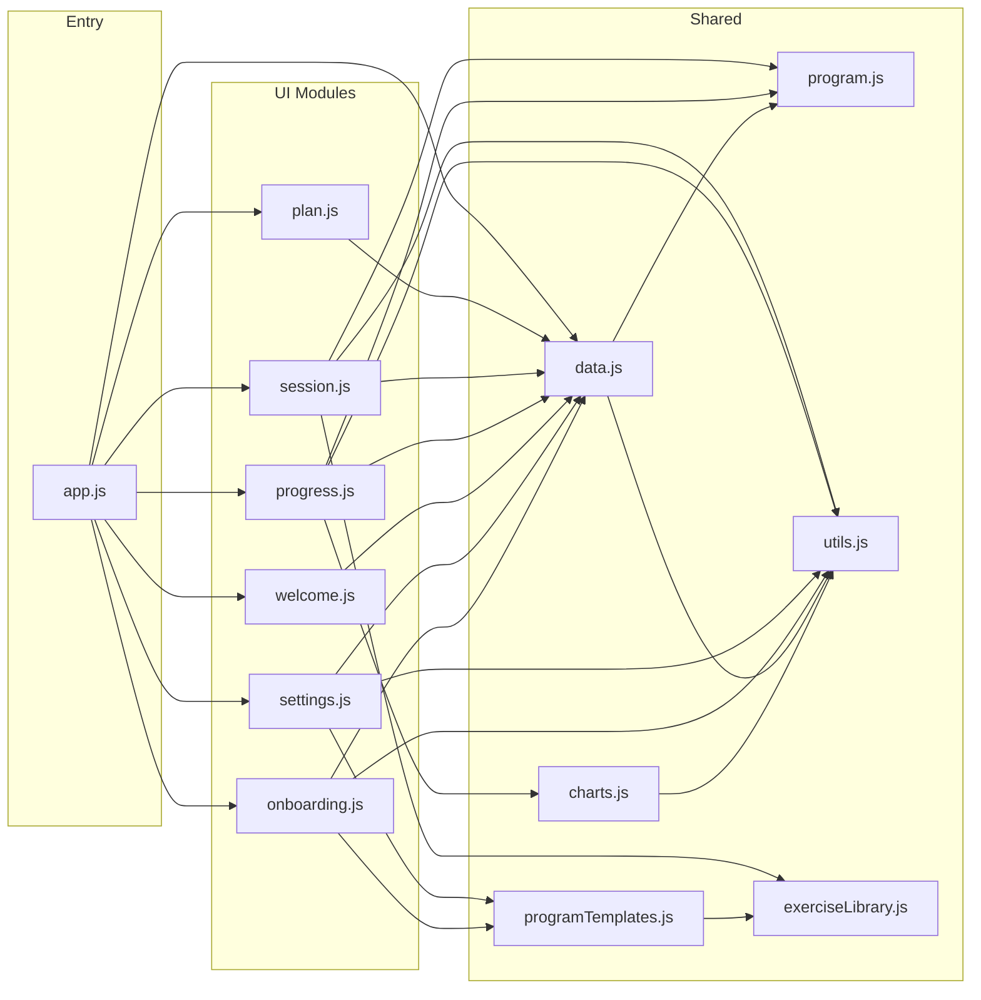
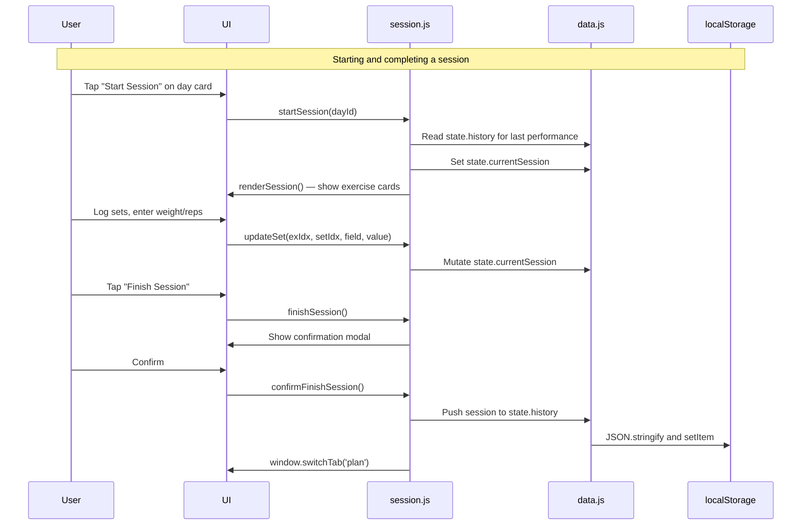
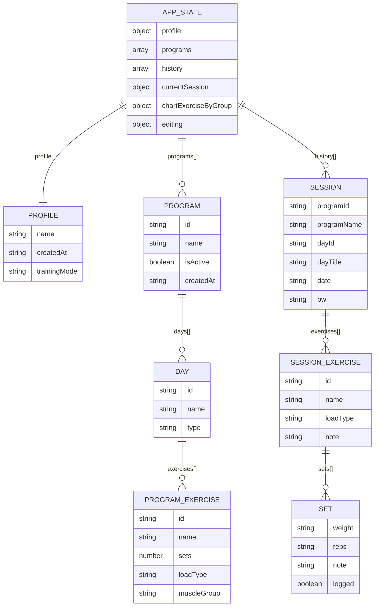
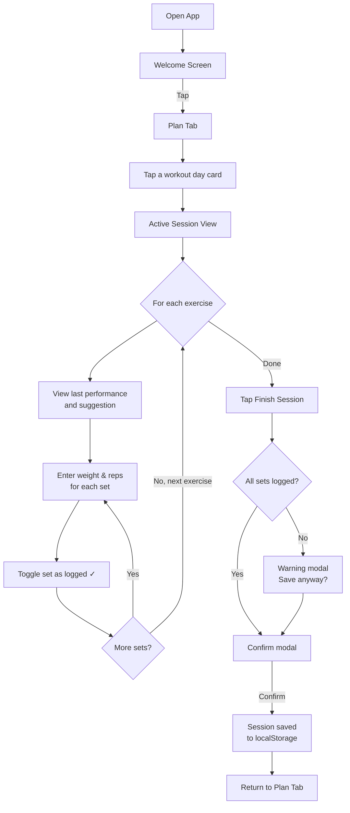
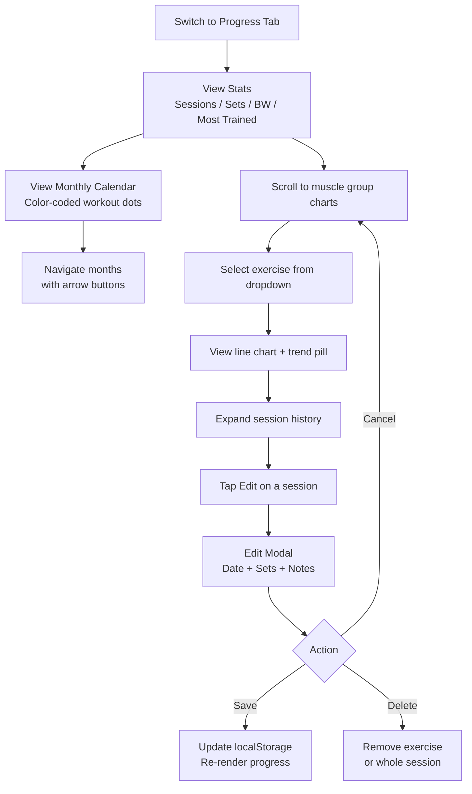
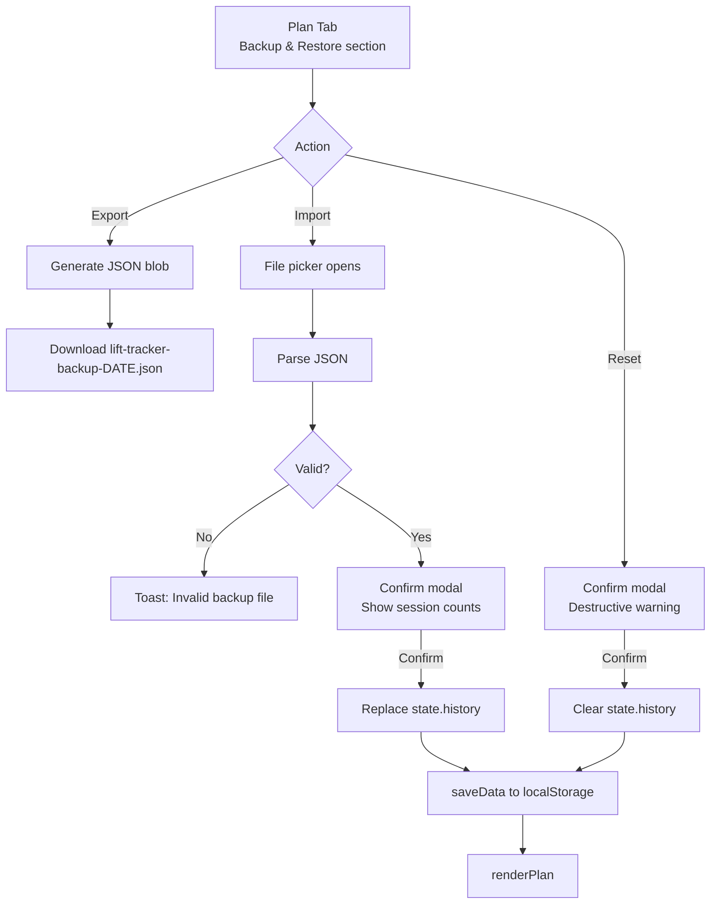
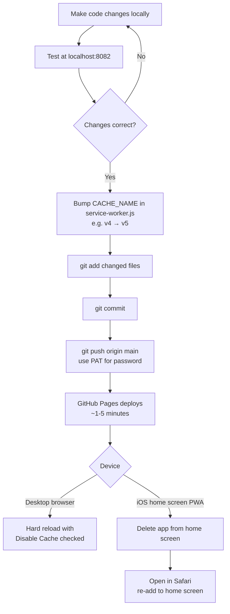

# Lift Tracker — Architecture Documentation

> **Living document.** Update this file alongside every structural code change.  
> See the bottom section for update instructions.

---

## 1. Overview

Lift Tracker is a personal workout tracking PWA. It is a **vanilla JS, no-build, no-framework** app using ES modules, CSS custom properties, and localStorage for persistence. It is deployed to GitHub Pages and installed as a home screen app on iOS.

- Single HTML shell (`index.html`) — all content rendered by JS
- Modular JS files with a single entry point (`app.js`)
- All event handlers bound to `window` in `app.js` to support inline `onclick` in dynamic HTML
- Service worker provides offline support and PWA installability

---

## 2. High-Level App Flow



---

## 3. Module Architecture



---

## 4. Module Dependencies & Responsibilities

| Module | Imports | Responsibilities |
|--------|---------|-----------------|
| `app.js` | All modules | Entry point. Binds all `window.*` handlers. Calls `loadData()`, shows onboarding if new user, otherwise `renderPlan()` + `showWelcomeScreen()`. Registers service worker (non-localhost only). |
| `program.js` | _(none)_ | Static data: original 4-day split, extended `MUSCLE_GROUPS` mapping (covers all exercise library IDs), display metadata. |
| `data.js` | `utils.js`, `program.js` | `state` object (profile, programs, history). `loadData()` with v2→v3 migration, `saveData()`, `exportData()`, `importData()`. Exports `migrateV2ToV3()`. |
| `utils.js` | _(none)_ | `todayDateString()`, `isoDateOnly()`, `formatDate()`, `formatDateShort()`, `showToast()`. |
| `exerciseLibrary.js` | _(none)_ | 60+ exercises with id, name, muscleGroup, loadType. `getExerciseById()`, `getExercisesByMuscleGroup()`, `searchExercises()`. |
| `programTemplates.js` | `exerciseLibrary.js` | 6 program templates (3-day full body, 4-day upper/lower, 4-day PPL, 5-day PPL, 6-day PPL 2×, 5-day bro split). `getTemplateById()`. |
| `onboarding.js` | `data.js`, `programTemplates.js`, `utils.js` | Multi-step new-user onboarding: welcome → name → mode → template/track-as-you-go → save. Also handles backup import during onboarding. |
| `settings.js` | `data.js`, `programTemplates.js`, `utils.js` | Settings tab: profile editing, program list/activate/duplicate/delete, create program from template, data backup/restore. |
| `session.js` | `data.js`, `program.js`, `exerciseLibrary.js`, `utils.js` | Structured and track-as-you-go session lifecycle. Exercise picker modal. `startSession()`, `startTrackAsYouGoWorkout()`, `renderSession()`, progressive overload hints. |
| `plan.js` | `data.js` | Renders Plan tab from active program in `state.programs`. Handles structured, track-as-you-go, and no-program states. |
| `progress.js` | `data.js`, `program.js`, `utils.js`, `charts.js` | Stats, calendar (dynamic colors by dayId hash), per-muscle charts, session history, edit modal. |
| `charts.js` | `utils.js` | `drawSingleLineChart()` — canvas-based line chart. |
| `welcome.js` | `data.js` | Splash screen using `state.profile.name` and active program's next workout. |

---

## 5. Data Flow



---

## 6. Data Schema



**localStorage key:** `liftTrackerData`  
**Schema version:** `3`  
**loadType values:** `'weight'` (barbell/dumbbell) | `'bw'` (bodyweight)  
**trainingMode values:** `'structured'` | `'trackAsYouGo'`  
**Migration:** `loadData()` auto-migrates v2 → v3 (builds default program from program.js, tags history with programId, creates profile with name "Reid").

---

## 7. Key User Workflows

### Workflow 1 — Logging a Workout Session



### Workflow 2 — Reviewing Progress and Editing History



### Workflow 3 — Backup, Restore, and Reset



---

## 8. Progressive Overload Logic

Defined in `session.js`:

```
getLastPerformance(exerciseId)
  → finds most recent session in state.history containing that exercise

getSuggestion(exerciseId, loadType)
  → if loadType === 'weight':
      suggest last top weight if all sets matched, else same weight
  → if loadType === 'bw':
      suggest +1 rep on top set

getLastExerciseNote(exerciseId)
  → returns { date, note } from most recent session
  → backward-compat: if no ex.note, assembles from set-level notes
    e.g. "Set 1: felt strong | Set 3: form broke"
```

These are displayed in the session view as "Last session" hints above each exercise card.

---

## 9. Styling & Theming

All design tokens live in `:root` in `css/main.css`. **Never hardcode colors** — always use variables.

| Variable | Value | Usage |
|----------|-------|-------|
| `--bg` | `#0a0a0a` | Page background |
| `--surface` | `#141414` | Cards |
| `--surface-2` | `#1c1c1c` | Inputs, nested cards |
| `--surface-3` | `#242424` | Deeply nested elements |
| `--border` | `#262626` | Default borders |
| `--border-bright` | `#383838` | Highlighted borders |
| `--text` | `#fafafa` | Primary text |
| `--text-dim` | `#888` | Secondary text |
| `--text-dimmer` | `#555` | Muted/disabled text |
| `--accent` | `#d4ff3a` | Neon lime — primary accent |
| `--push` | `#ff6b35` | Upper A / push day |
| `--pull` | `#3a9eff` | Upper B / pull day |
| `--legs` | `#d4ff3a` | Lower days (same as accent) |
| `--recovery` | `#b86bff` | Lower B / posterior |
| `--success` | `#4ade80` | Confirmation states |

**Typography:**
- `Archivo Black` — display headings, large text
- `JetBrains Mono` — labels, stats, monospace UI
- `Inter Tight` — body text, secondary copy

---

## 10. Deployment & Updates



**Remote:** `https://github.com/reidrussell-alt/lifting-tracker-Application.git`  
**Auth:** Personal Access Token (GitHub no longer accepts passwords)  
**Current SW cache version:** `lift-tracker-v5`

---

## 11. Future Roadmap

- [ ] Show welcome screen only once per day (not every open)
- [ ] Rest timer between sets
- [ ] Weekly/monthly volume summary on Progress tab
- [ ] Swipe gestures on session cards
- [ ] Dark/light mode toggle
- [ ] Workout streak tracking
- [ ] Push notification reminders
- [ ] Custom program builder (day-by-day exercise picker, not template-based)
- [ ] Filter Progress charts by program
- [ ] "Create plan from history" wizard for track-as-you-go users

---

## 12. Change Log

| Date | Change |
|------|--------|
| 2026-05-04 | Multi-program support: onboarding, exercise library, 6 templates, Settings tab, track-as-you-go mode, v2→v3 data migration; SW bumped to v5 |
| 2026-05-04 | Added `ARCHITECTURE.md` and updated `CLAUDE.md` with architecture section |
| 2026-05-04 | Added welcome screen (`welcome.js`) with dynamic greeting, workout label, staggered animations, tap-to-dismiss |
| 2026-05-03 | Initial modular rebuild deployed to GitHub Pages; bumped SW to v4 |
| 2026-05-03 | Added monthly calendar view to Progress tab with color-coded workout dots |
| 2026-04-xx | Added per-exercise notes with backward compatibility for set-level notes |
| 2026-04-xx | Initial modular rebuild from single-file `preview.html` |

---

## 13. Updating This Document

**Update this file whenever you:**
- Add or remove a JS module
- Change cross-module dependencies
- Modify localStorage schema or add new fields
- Add new tabs, pages, or major UI sections
- Change the deployment process
- Complete a roadmap item

**Which section to update:**

| Change type | Section |
|-------------|---------|
| New tab or navigation | §2 High-Level App Flow |
| New JS file or import | §3 Module Architecture + §4 Dependencies |
| localStorage schema change | §6 Data Schema |
| New feature workflow | §7 Key User Workflows |
| New overload logic | §8 Progressive Overload Logic |
| New CSS variable | §9 Styling & Theming |
| Deployment process change | §10 Deployment |
| Completed or new planned feature | §11 Future Roadmap |
| Any change | §12 Change Log — add dated entry |
